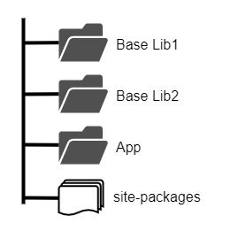

# conda
# &
# conda devenv

---

### What is conda?

*Package, dependency and environment management*

https://conda.io/miniconda.html

---

### Famous Python distributions

- Enthought
- WxPython
- Python(x,y)
- Anaconda |

---

Creating and activating
```shell
> conda create -n mylib
> source activate mylib
> conda install pandas
> conda list
```
@[1-3]
@[4]

---

Sharing environments

```shell
> conda list

> conda env export > environment.yml

> conda create -f environment.yml
```

@[1]
@[3]
@[5]

---

Install specific versions

```shell
> conda create -n mypy27 python=2.7 numpy=1.11
Fetching package metadata .............
Solving package specifications: .

Package plan for installation in environment W:\conda-intro\envs\mypy27:

The following NEW packages will be INSTALLED:

    certifi:        2017.11.5-py27h03b45e1_0
    icc_rt:         2017.0.4-h97af966_0
    intel-openmp:   2018.0.0-hd92c6cd_8
    mkl:            2018.0.1-h2108138_4
    numpy:          1.11.3-py27hab9e983_3
    pip:            9.0.1-py27hdaa76b4_4
    python:         2.7.14-h8c3f1cb_23
    setuptools:     36.5.0-py27ha483b79_0
    vc:             9-h7299396_1
    vs2008_runtime: 9.00.30729.1-hfaea7d5_1
    wheel:          0.30.0-py27ha643586_1
    wincertstore:   0.2-py27hf04cefb_0
```

@[1]
@[2-22]

---

### conda x virtualenv

- conda manages python versions
- hardlink packages

---

### conda x pip

<ul>
<li>No compiler needed for C ext<span class="fragment">(before wheels)</span></li>
<li>One version of the binaries (no flags, deppies, options)</li>
<li>Channels (conda-forge, private)</li>
</ul>

---

### mu-repo

Multiple repositories synchronization



---

- Conda Documentation, https://conda.io
- mu-repo, http://fabioz.github.io/mu-repo/
- Fernandes, Filipe; *Community powered packaging: conda-forge*, PyCon 2017

